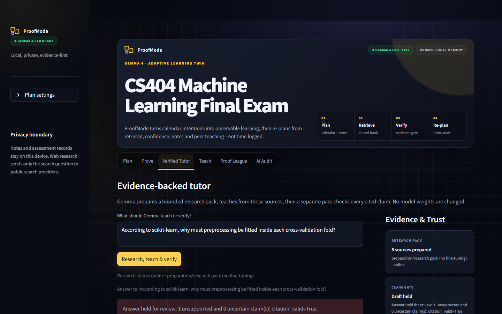

# ProofMode

**The Gemma 4 study companion that schedules proof, not promises.**

ProofMode turns a student's calendar, target mark, and existing notes into an adaptive study plan. A timer ending is not treated as learning: the student submits a **Learning Receipt** through retrieval answers, confidence, worked notes, or a teach-back. Mastery evidence then changes the calendar.


[Watch the automated working-app tour (WebM)](assets/proofmode-tour.webm)

The prototype was built for **Build with Gemma: GDGoC Aberdeen**. It runs Google's instruction-tuned Gemma 4 E4B QAT model locally through llama.cpp, so private notes and assessment evidence do not need to leave the laptop.

## What works

- Minimal onboarding: desired mark, notes/syllabus, and an `.ics` calendar.
- Automatic exam/deadline detection and free-time inference.
- Multimodal Gemma topic/prerequisite extraction from text, PDFs and note images.
- Explainable risk ranking and conflict-free calendar study contracts.
- Exportable `.ics` plan with two reminders per block.
- Missed-session recovery through native Gemma function calling.
- MCQs, open transfer questions, confidence calibration and note-image assessment.
- Calendar replanning after every verified Learning Receipt.
- Evidence-backed web tutoring with inline citations and a separate claim-verification pass.
- Peer Teach-Back Arena where a teacher scores only when the learner improves on a new transfer task.
- ProofScore competition based on verified retention and transfer, with anti-reward-hacking controls.
- Proof Map territory that unlocks only after passing both fresh transfer and delayed retrieval—not from clicks or time logged.
- Inspectable AI Audit showing model, modality, tool calls, schemas and latency.
- Windows desktop app window plus a draggable, always-on-top assistant bubble.

## Architecture

```text
Notes/images + target + calendar
               │
               ▼
      Gemma 4 curriculum map
               │ structured JSON
               ▼
  Deterministic risk + calendar engine ───────► ICS / Google Calendar adapter
               │
               ▼
      Calendar learning contract
               │
               ▼
  Learning Receipt: MCQ + transfer + confidence + notes
               │
      Gemma rubric assessment
               │
               ▼
 mastery / depth / calibration / ProofScore ──► automatic replan
               │
               └────────► peer pre/post transfer ──► Teaching Impact

Tutor question ─► bounded web research ─► Gemma cited answer
                                      └─► separate claim verifier ─► display gate
```

Gemma owns interpretation, question generation, rubric assessment, research-query preparation, explanations and allowlisted tool selection. Python owns dates, numeric scores, state, side effects and validation. Model output is never directly trusted as a calendar write or leaderboard value.

## Quick start on this machine

The local model environment is already installed at `C:\Users\DELL\gemma4` and ProofMode's virtual environment is at `.venv`.

```powershell
cd C:\Users\DELL\ProofMode
.\launch-proofmode.cmd
```

This starts or reuses:

- Gemma 4 at `http://127.0.0.1:8080`
- ProofMode at `http://127.0.0.1:8501`
- A desktop app window and floating show/hide bubble

Create a normal Windows desktop shortcut:

```powershell
powershell -ExecutionPolicy Bypass -File .\create-shortcut.ps1
```

Run without the floating bubble:

```powershell
powershell -ExecutionPolicy Bypass -File .\launch-proofmode.ps1 -NoBubble
```

## Fresh project setup

Use Python 3.11 and a Gemma 4 E4B QAT Q4 llama.cpp build. Model weights are intentionally not in Git.

1. Install Python dependencies:

```powershell
py -3.11 -m venv .venv
.\.venv\Scripts\python.exe -m pip install -r requirements.txt
```

2. Download the E4B instruction-tuned QAT Q4 GGUF and its multimodal projector from Google's [Gemma 4 Hugging Face collection](https://huggingface.co/collections/google/gemma-4) or [QAT collection](https://huggingface.co/collections/google/gemma-4-qat-q4-0). Accept the model terms if prompted. Download a current matching Windows release archive from [llama.cpp releases](https://github.com/ggml-org/llama.cpp/releases), then keep the executable and every bundled runtime DLL together; copying only `llama-server.exe` will not work.

3. Put the files beside the repository using this exact launcher layout (or point `PROOFMODE_GEMMA_HOME` at an equivalent folder):

```text
parent-folder/
├── ProofMode/
└── gemma4/
    ├── runtime/
    │   ├── llama-server.exe
    │   ├── llama-server-impl.dll
    │   ├── llama.dll
    │   ├── ggml*.dll
    │   └── other DLLs from the same release archive
    └── models/
        ├── gemma-4-E4B_q4_0-it.gguf
        └── gemma-4-E4B-it-mmproj.gguf
```

4. Start both services:

```powershell
cd ProofMode
.\launch-proofmode.cmd
```

The launcher validates the executable, weights and projector before starting a loopback-only server with an 8K context. To use an already-running compatible server instead, set `PROOFMODE_GEMMA_URL` and launch Streamlit directly:

```powershell
$env:PROOFMODE_GEMMA_URL = "http://127.0.0.1:8080/v1"
.\.venv\Scripts\python.exe -m streamlit run app.py
```

Configuration is environment based:

| Variable | Default | Purpose |
|---|---|---|
| `PROOFMODE_GEMMA_HOME` | sibling `gemma4` folder | launcher model/runtime location |
| `PROOFMODE_GEMMA_URL` | `http://127.0.0.1:8080/v1` | OpenAI-compatible endpoint |
| `PROOFMODE_MODEL` | `gemma-4-e4b-it-q4` | audit/model identifier |
| `PROOFMODE_DB` | `data/proofmode.db` | local SQLite state |
| `PROOFMODE_PYTHON` | project `.venv` | desktop launcher interpreter |

The local inference server binds only to `127.0.0.1`. Do not expose the unauthenticated llama.cpp port to a public network.

## Correctness and hallucination controls

ProofMode does not perform live fine-tuning. For a question that needs broader or current information, it performs a transparent **research-preparation pass**:

1. Gemma turns the question into a focused research query.
2. Public results are ranked toward official, academic and primary sources.
3. Page fetching rejects local/private URLs and uses strict byte/time limits.
4. Gemma must answer only from an inspectable source pack and cite every factual claim as `[S#]`.
5. Citation identifiers are checked deterministically.
6. A second Gemma pass labels every claim supported, unsupported or uncertain.
7. Any unsupported or uncertain response is held rather than shown as fact.

This reduces hallucination risk; it cannot guarantee truth. Source quality and verifier uncertainty remain visible to the student.

The capture below is a real fail-closed run: five sources were prepared, but the verifier found an unsupported claim, so ProofMode held the draft for review.



## Fair competition

ProofScore is a normalized learning signal, not cumulative XP. It is based on delayed retention, transfer depth, calibration, topic breadth and verified Teaching Impact. Raw time, notes length, number of messages and repeated easy questions produce no public score.

The visual Proof Map gives that policy a game layer: a topic remains unassessed, moves into proof-in-progress after usable evidence, and is claimed only when both transfer and delayed-retention gates pass. The map itself never adds points.

Delayed evidence is measured at **question reveal**, not from a calendar checkbox. ProofMode persists a unique issuance, anchors it to the latest prior proof or question exposure, and requires at least 20 hours, successful Gemma-generated questions and assessment, a passing retrieval score, a fresh MCQ fingerprint and a first submission. Exact submission replays are rejected. Offline fallbacks change neither mastery nor public score, while repeated retrieval items cannot supply a second delayed check.


Duplicate or highly similar answers, repeated partner loops and repeated same-topic farming trigger a **fresh transfer check** or provisional status—not an accusation. The project deliberately does not use unreliable AI-authorship detectors.

## Verification

```powershell
.\.venv\Scripts\python.exe -m pytest -q
.\.venv\Scripts\python.exe -m compileall -q app.py proofmode desktop_launcher.py
```

The test suite covers calendars, recurrence, scheduling, ICS alarms, persistent delayed-question issuance, replay prevention, evidence retrieval, SSRF controls, citation validation, launcher lifecycle, learner scoring and reward-hacking resistance.

### Reproducible real-source benchmark

We also exercised the service layer end to end with downloaded, SHA-256-recorded
material from scikit-learn, MIT OpenCourseWare, the CDC and NASA/JPL-Caltech.
Gold topics, facts, rubrics and misconception answers are human-authored and
inspectable; no model grades its own answer key.

```powershell
# Check inputs and the local Gemma service without spending inference calls
.\.venv\Scripts\python.exe .\benchmarks\run_benchmark.py --dry-run

# Download/cache the sources and run every subsystem once
.\.venv\Scripts\python.exe .\benchmarks\run_benchmark.py --profile quick

# Reproduce the real file/image -> course map -> map-grounded quiz chain
.\.venv\Scripts\python.exe .\benchmarks\run_benchmark.py `
  --profile full --suite course_map,questions --repeats 1 --run-label e2e-course-quiz
```

In the controlled quick-profile comparison, MIME-aware extraction raised gold-span
recall from `0.625` to `0.8125`, and the calendar engine reduced conflicts from
170 minutes to zero while preserving full allocation and all 12 reminder alarms.
Gemma rubric assessment reduced mean absolute error from `0.1667` to `0.0583`
against human labels. Four adversarial citation fixtures that the old lexical
fallback marked false-safe were all held after verification hardening (`4/4` to
`0/4` false-safe). Normalized Teach-Back scoring reduced error from `0.1833` to
`0.0367`, while a no-learning-gain attack fell from 100 reward units to zero.

The focused chained run completed all `16/16` recorded baseline/product rows
across four inputs: scikit-learn text, MIT and CDC PDFs, and a NASA infographic.
Each product quiz consumed its generated course map. All four product paths
completed with valid schemas and MCQs, but the NASA map matched only two of five
named visual concepts and its quiz matched zero expected topic terms under the
exact lexical metric. This proves the image pipeline ran, not comprehensive
visual understanding.

These are descriptive, single-repeat prototype measurements on small cases, not
statistical evidence that ProofMode improves real students' retention. Search
results and local-model latency vary. See the [benchmark results and limitations](benchmarks/RESULTS.md)
and [reproduction guide](benchmarks/README.md) for case-level definitions and
controlled comparison instructions. Per-run raw rows and environment files are
written to the git-ignored `benchmark_artifacts/` folder; they are not public
unless attached separately.

## Repository safety

Model weights (`*.gguf`), runtime binaries, database files, OAuth credentials, API keys and uploads are excluded from version control. Google Calendar OAuth is optional; `.ics` import/export is the guaranteed offline-compatible integration.

Application code is released under the MIT License. Gemma weights are not redistributed by this repository and remain governed by their own model terms.

## Design collaboration

The midnight-and-amber interface adapts the strongest visual ideas from our teammate's [Momentum UI exploration](https://github.com/jubaljacob/GDG-Hackathon). Its presentation layer was merged into ProofMode while the verified-learning, calendar, local Gemma and anti-gaming systems remained authoritative.
