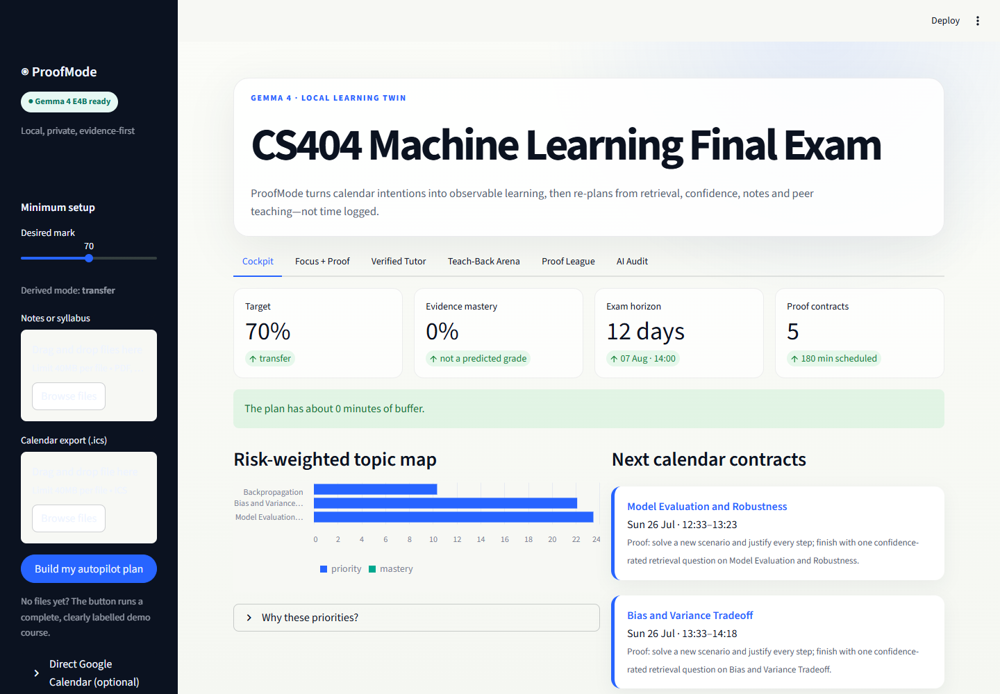
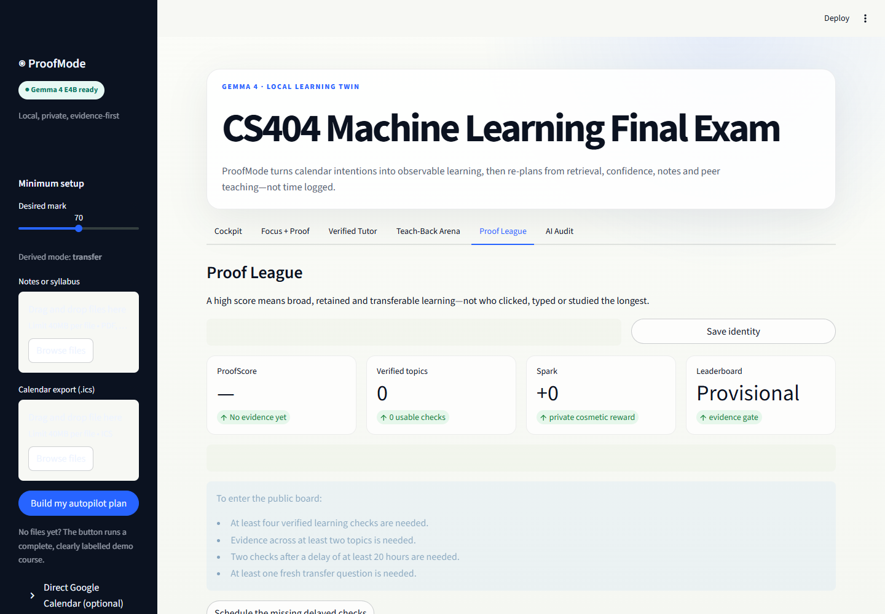

# ProofMode

**The Gemma 4 study companion that schedules proof, not promises.**

ProofMode turns a student's calendar, target mark, and existing notes into an adaptive study plan. A timer ending is not treated as learning: the student submits a **Learning Receipt** through retrieval answers, confidence, worked notes, or a teach-back. Mastery evidence then changes the calendar.



The prototype was built for **Build with Gemma: GDGoC Aberdeen**. It runs Google's instruction-tuned Gemma 4 E4B QAT model locally through llama.cpp, so private notes and assessment evidence do not need to leave the laptop.

## What works

- Minimal onboarding: desired mark, notes/syllabus, and an `.ics` calendar.
- Automatic exam/deadline detection and free-time inference.
- Multimodal Gemma topic/prerequisite extraction from text, PDFs and note images.
- Explainable risk ranking and conflict-free calendar study contracts.
- Exportable `.ics` plan with two reminders per block.
- Missed-session recovery through native Gemma function calling.
- MCQs, open transfer questions, confidence calibration and note-image assessment.
- Calendar replanning after every Learning Receipt.
- Evidence-backed web tutoring with inline citations and a separate claim-verification pass.
- Peer Teach-Back Arena where a teacher scores only when the learner improves on a new transfer task.
- ProofScore competition based on verified retention and transfer, with anti-reward-hacking controls.
- Inspectable AI Audit showing model, modality, tool calls, schemas and latency.
- Windows desktop app window plus a draggable, always-on-top assistant bubble.

## Architecture

```text
Notes/images + target + calendar
               │
               ▼
      Gemma 4 curriculum map
               │ structured JSON
               ▼
  Deterministic risk + calendar engine ───────► ICS / Google Calendar adapter
               │
               ▼
      Calendar learning contract
               │
               ▼
  Learning Receipt: MCQ + transfer + confidence + notes
               │
      Gemma rubric assessment
               │
               ▼
 mastery / depth / calibration / ProofScore ──► automatic replan
               │
               └────────► peer pre/post transfer ──► Teaching Impact

Tutor question ─► bounded web research ─► Gemma cited answer
                                      └─► separate claim verifier ─► display gate
```

Gemma owns interpretation, question generation, rubric assessment, research-query preparation, explanations and allowlisted tool selection. Python owns dates, numeric scores, state, side effects and validation. Model output is never directly trusted as a calendar write or leaderboard value.

## Quick start on this machine

The local model environment is already installed at `C:\Users\DELL\gemma4` and ProofMode's virtual environment is at `.venv`.

```powershell
cd C:\Users\DELL\ProofMode
.\launch-proofmode.cmd
```

This starts or reuses:

- Gemma 4 at `http://127.0.0.1:8080`
- ProofMode at `http://127.0.0.1:8501`
- A desktop app window and floating show/hide bubble

Create a normal Windows desktop shortcut:

```powershell
powershell -ExecutionPolicy Bypass -File .\create-shortcut.ps1
```

Run without the floating bubble:

```powershell
powershell -ExecutionPolicy Bypass -File .\launch-proofmode.ps1 -NoBubble
```

## Fresh project setup

Use Python 3.11 and a working local Gemma 4 llama.cpp server:

```powershell
python -m venv .venv
.\.venv\Scripts\python.exe -m pip install -r requirements.txt
.\.venv\Scripts\python.exe -m streamlit run app.py
```

Configuration is environment based:

| Variable | Default | Purpose |
|---|---|---|
| `PROOFMODE_GEMMA_HOME` | sibling `gemma4` folder | launcher model/runtime location |
| `PROOFMODE_GEMMA_URL` | `http://127.0.0.1:8080/v1` | OpenAI-compatible endpoint |
| `PROOFMODE_MODEL` | `gemma-4-e4b-it-q4` | audit/model identifier |
| `PROOFMODE_DB` | `data/proofmode.db` | local SQLite state |
| `PROOFMODE_PYTHON` | project `.venv` | desktop launcher interpreter |

The local inference server binds only to `127.0.0.1`. Do not expose the unauthenticated llama.cpp port to a public network.

## Correctness and hallucination controls

ProofMode does not perform live fine-tuning. For a question that needs broader or current information, it performs a transparent **research-preparation pass**:

1. Gemma turns the question into a focused research query.
2. Public results are ranked toward official, academic and primary sources.
3. Page fetching rejects local/private URLs and uses strict byte/time limits.
4. Gemma must answer only from an inspectable source pack and cite every factual claim as `[S#]`.
5. Citation identifiers are checked deterministically.
6. A second Gemma pass labels every claim supported, unsupported or uncertain.
7. Any unsupported or uncertain response is held rather than shown as fact.

This reduces hallucination risk; it cannot guarantee truth. Source quality and verifier uncertainty remain visible to the student.

## Fair competition

ProofScore is a normalized learning signal, not cumulative XP. It is based on delayed retention, transfer depth, calibration, topic breadth and verified Teaching Impact. Raw time, notes length, number of messages and repeated easy questions produce no public score.



Duplicate or highly similar answers, repeated partner loops and repeated same-topic farming trigger a **fresh transfer check** or provisional status—not an accusation. The project deliberately does not use unreliable AI-authorship detectors.

## Verification

```powershell
.\.venv\Scripts\python.exe -m pytest -q
.\.venv\Scripts\python.exe -m compileall -q app.py proofmode desktop_launcher.py
```

The test suite covers calendars, recurrence, scheduling, ICS alarms, evidence retrieval, SSRF controls, citation validation, launcher lifecycle, learner scoring and reward-hacking resistance.

## Repository safety

Model weights, runtime binaries, database files, OAuth credentials, API keys and uploads are excluded from version control. Google Calendar OAuth is optional; `.ics` import/export is the guaranteed offline-compatible integration.

Application code is released under the MIT License. Gemma weights are not redistributed by this repository and remain governed by their own model terms.
